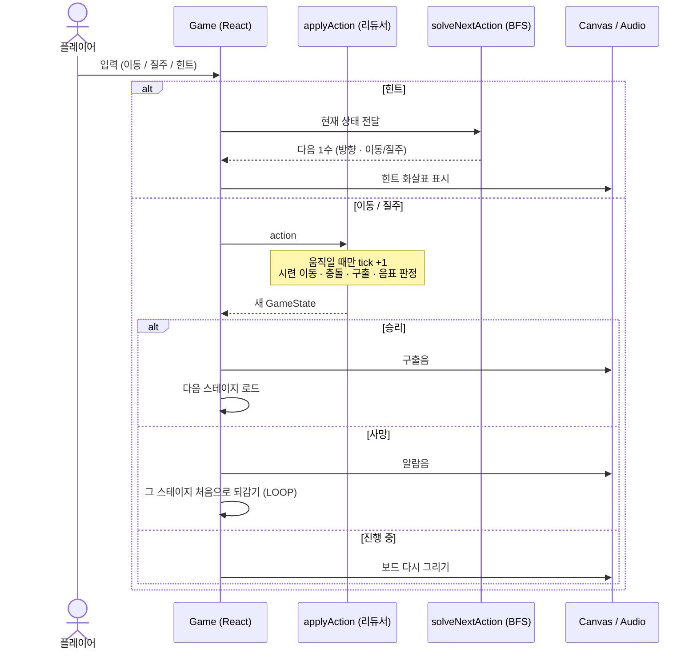

> 블래스트(VLAST) 서비스 개발자 사전과제 · **'속도'를 재해석한 웹 게임**

---

## 게임 소개

격자(그리드) 위에서 풀어가는 **턴제 퍼즐 게임**입니다. 적('시련')의 이동 패턴을 멈춰서 읽고 안전한 순간에 한 칸씩 움직이거나 벽까지 단숨에 **질주(Dash)** 해 목표 지점에 도달하면 됩니다.

- **구성**: 튜토리얼 1 + 본편 5스테이지 + 엔딩.

---

## Keyword: 속도

**'속도'** 라는 단어에서 가장 먼저 **상대성 이론**을 떠올렸습니다.

상대성 이론과 관련해 가장 기억에 남았던 콘텐츠인 영화 **'인터스텔라'** 가 이어서 떠올랐고, 그 안의 **'블랙홀'** — 타임 워프, 즉 **시간을 건너뛸 수 있는 통로** 라는 이미지를 도출해냈습니다.

이 도출 과정을 **PLAVE의 세계관**, 그리고 최근 발매된 **'Born Savage'(Caligo Pt.2)의 에필로그** 해석 등과 함께 분석했습니다. 에필로그 끝의 알람음이 '여섯 번째 여름' 도입부와 이어진다는 점에서, **"PLAVE가 '여섯 번째 여름'의 세계관으로 돌아갔을 가능성이 있다"** 는 해석을 차용했습니다.

여기에 더해, **'여섯 번째 여름'의 뮤직비디오·곡 자체가 "타임 루프"** 라는 해석이 있어 — 이 곡을 컨셉으로 삼아 게임을 만들기로 했습니다.
그래서 각 스테이지는 멤버들이 **여섯 번째의 여름으로 가는 타임 워프** 컨셉으로 잡아 구성했습니다.

---

## How to Play

- **목표**: 각 스테이지에서 멤버(또는 튜토리얼의 흰 마커)를 구하고 **빛나는 구멍(웜홀)** 으로 들어가면 다음 스테이지로 이동할 수 있습니다.
- **시련**(붉은 적)에 닿으면 그 스테이지의 처음으로 되돌아갑니다.
- **음표(♪)** 를 모으면 **힌트**(다음 1수)를 쓸 수 있습니다.

### 조작

|             | PC              | 모바일         |
| ----------- | --------------- | -------------- |
| 이동(한 칸) | 방향키 / `WASD` | 스와이프(짧게) |
| 질주(Dash)  | `Shift` + 방향  | 스와이프(길게) |
| 힌트        | `H`             | HUD의 `♪` 버튼 |

힌트 화살표 색: **노란색 = 한 칸 이동**, **주황색 = 질주**.

첫 스테이지(1번째 여름은) 위 조작을 단계별로 알려주는 **튜토리얼**입니다.

---

## 로컬 실행

```bash
# Node 24.14.0 (.nvmrc)
npm install
npm run dev        # http://localhost:3000

npm run build      # 프로덕션 빌드
npm test           # 단위 테스트 (Vitest)
```

---

## 기술 스택

- **Next.js (App Router) · TypeScript · Tailwind CSS v4 · React 19**
- **렌더링**: DOM/CSS(UI) + Canvas(보드·연출) 하이브리드
- **상태**: 불변 리듀서(`applyAction`) — 이동/질주/힌트
- **힌트 / 풀이 검증**: BFS 최단 경로 탐색으로 '다음 1수' 힌트를 계산하고, 각 레벨의 해 존재·최단 길이도 같은 BFS로 산출
- **테스트**: 핵심 로직 TDD(Vitest)
- **오디오**: 전부 Web Audio로 합성 — **외부 파일·저작권 0**
- **PLAVE 세계관/모티브 차용**

### 한 번의 입력이 처리되는 흐름



---

## 배포

- Vercel URL 링크: **https://web-play-sigma.vercel.app/**

---

<details>
<summary>스테이지별 정답 (BFS 최단 해법 · 스포일러)</summary>

| 스테이지         | 수  | 해답                                                                                                                                |
| ---------------- | --- | ----------------------------------------------------------------------------------------------------------------------------------- |
| 1번째 (튜토리얼) | 2   | 질주→ 질주↓                                                                                                                         |
| 2번째 (은호)     | 8   | 질주↓ 이동→ 이동→ 질주↑ 질주↓ 질주↑ 질주↓ 질주→                                                                                     |
| 3번째 (예준)     | 9   | 질주↓ 이동↑ 이동↑ 이동→ 이동→ 이동→ 이동→ 질주↓ 질주→                                                                               |
| 4번째 (하민)     | 13  | 질주↓ 이동→ 이동→ 이동→ 이동→ 이동→ 이동→ 이동↑ 이동↑ 질주→ 질주← 질주→ 질주↓                                                       |
| 5번째 (노아)     | 18  | 질주↓ 질주↑ 이동→ 이동→ 이동→ 질주← 질주↓ 질주→ 이동← 이동← 이동← 이동← 이동↑ 이동↑ 이동← 이동→ 질주↓ 질주→                         |
| 6번째 (밤비)     | 22  | 이동↓ 이동↑ 질주↓ 질주↑ 이동↓ 이동↑ 질주↓ 질주↑ 이동→ 이동→ 질주← 질주↓ 이동→ 이동→ 이동→ 이동→ 이동↑ 이동↑ 이동→ 이동← 질주↓ 질주→ |

> ↑↓ 왕복은 헛수가 아니라 **시간 흘리기**(타이밍 회피) — 시간은 내가 움직일 때만 흐르므로 제자리 왕복으로 칼리고 안전창을 만든 뒤 진입합니다.

</details>
